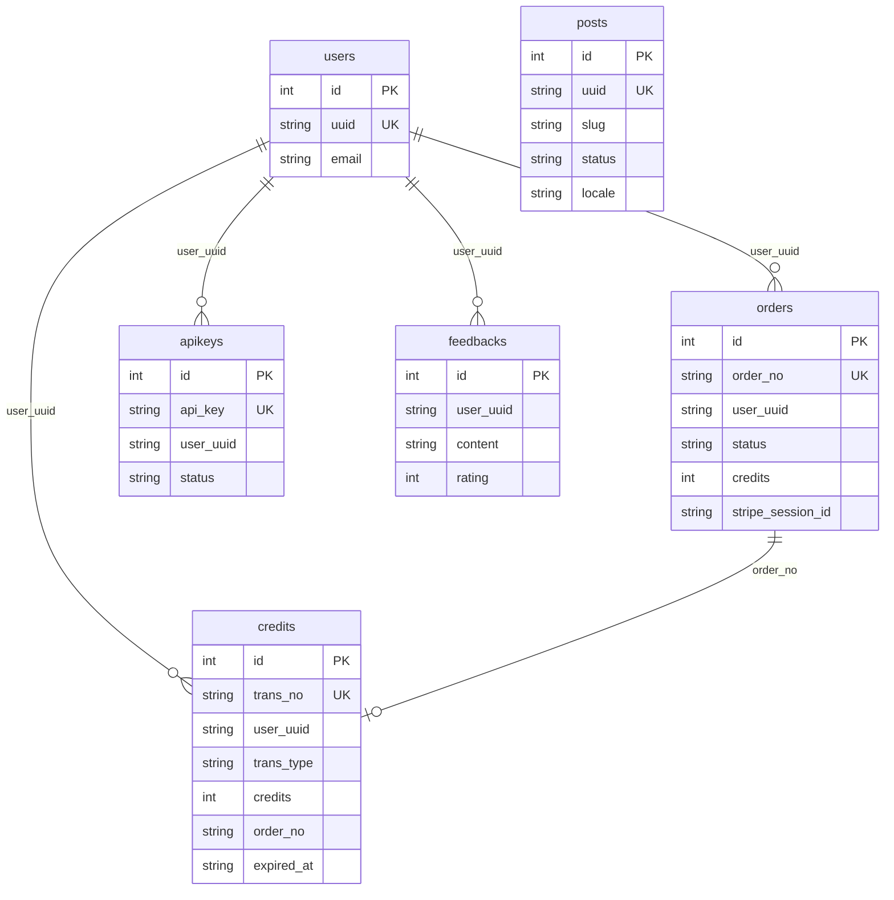
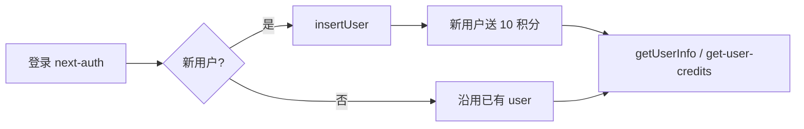
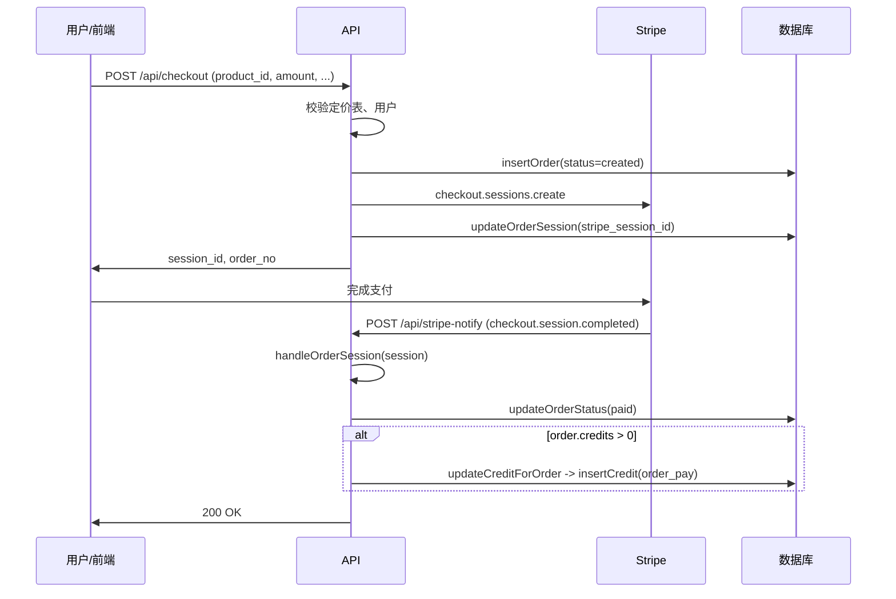
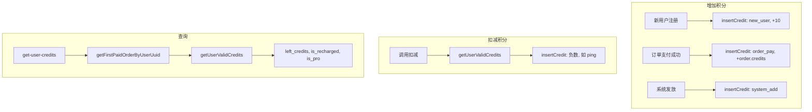
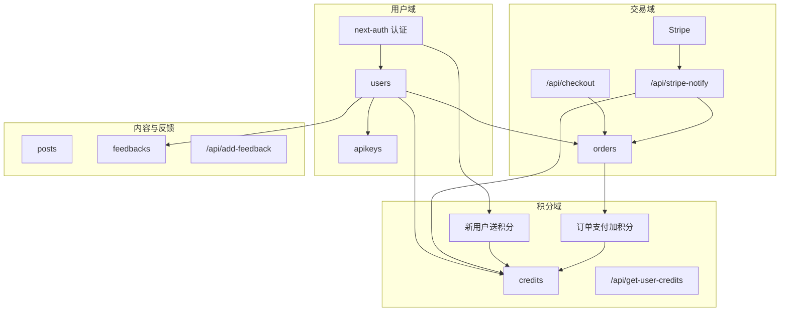

# SaasNext项目知识图谱

本文档从零描述当前项目的数据库设计与业务流，以表格和 Mermaid 图形式呈现，便于从头构建或理解项目。

---

## 一、数据库设计

### 1.1 表清单

| 表名      | 说明                | 主要关联                 |
| --------- | ------------------- | ------------------------ |
| users     | 用户账号与资料      | orders, apikeys, credits, feedbacks |
| orders    | 订单（Stripe 支付） | users, credits          |
| apikeys   | API 密钥            | users                    |
| credits   | 积分/额度流水       | users, orders            |
| posts     | 博客/文章           | -                        |
| feedbacks | 用户反馈            | users                    |

### 1.2 表结构详情

#### users

| 字段            | 类型                     | 约束                   | 说明               |
| --------------- | ------------------------ | ---------------------- | ------------------ |
| id              | SERIAL                   | PRIMARY KEY            | 自增主键           |
| uuid            | VARCHAR(255)             | UNIQUE NOT NULL        | 用户唯一标识       |
| email           | VARCHAR(255)             | NOT NULL               | 邮箱               |
| created_at      | timestamptz              |                        | 创建时间           |
| nickname        | VARCHAR(255)             |                        | 昵称               |
| avatar_url      | VARCHAR(255)             |                        | 头像 URL           |
| locale          | VARCHAR(50)              |                        | 语言               |
| signin_type     | VARCHAR(50)              |                        | 登录类型           |
| signin_ip       | VARCHAR(255)             |                        | 登录 IP            |
| signin_provider | VARCHAR(50)              |                        | 登录提供商         |
| signin_openid   | VARCHAR(255)             |                        | 第三方 OpenID      |
| updated_at      | timestamptz              |                        | 更新时间           |
| UNIQUE          | (email, signin_provider) |                        | 同邮箱同提供商唯一 |

#### orders

| 字段               | 类型         | 约束                | 说明                       |
| ------------------ | ------------ | ------------------- | -------------------------- |
| id                 | SERIAL       | PRIMARY KEY         | 自增主键                   |
| order_no           | VARCHAR(255) | UNIQUE NOT NULL     | 订单号                     |
| created_at         | timestamptz  |                     | 创建时间                   |
| user_uuid          | VARCHAR(255) | NOT NULL DEFAULT '' | 下单用户 uuid              |
| user_email         | VARCHAR(255) | NOT NULL DEFAULT '' | 下单邮箱                   |
| amount             | INT          | NOT NULL            | 金额（分/美分）            |
| interval           | VARCHAR(50)  |                     | 周期：year/month/one-time  |
| expired_at         | timestamptz  |                     | 权益过期时间               |
| status             | VARCHAR(50)  | NOT NULL            | created / paid / deleted   |
| stripe_session_id  | VARCHAR(255) |                     | Stripe Checkout Session ID |
| credits            | INT          | NOT NULL            | 本单赠送积分数量           |
| currency           | VARCHAR(50)  |                     | 货币如 usd, cny            |
| sub_id             | VARCHAR(255) |                     | 订阅 ID                    |
| sub_interval_count | int          |                     | 订阅间隔数                 |
| sub_cycle_anchor   | int          |                     | 订阅周期锚点               |
| sub_period_end     | int          |                     | 订阅周期结束               |
| sub_period_start   | int          |                     | 订阅周期开始               |
| sub_times          | int          |                     | 订阅次数                   |
| product_id         | VARCHAR(255) |                     | 商品 ID                    |
| product_name       | VARCHAR(255) |                     | 商品名称                   |
| valid_months       | int          |                     | 有效月数                   |
| order_detail       | TEXT         |                     | 订单详情 JSON              |
| paid_at            | timestamptz  |                     | 支付完成时间               |
| paid_email         | VARCHAR(255) |                     | 支付使用邮箱               |
| paid_detail        | TEXT         |                     | 支付详情 JSON              |

#### apikeys

| 字段       | 类型         | 约束            | 说明              |
| ---------- | ------------ | --------------- | ----------------- |
| id         | SERIAL       | PRIMARY KEY     | 自增主键          |
| api_key    | VARCHAR(255) | UNIQUE NOT NULL | 密钥（如 sk-xxx） |
| title      | VARCHAR(100) |                 | 备注标题          |
| user_uuid  | VARCHAR(255) | NOT NULL        | 所属用户 uuid     |
| created_at | timestamptz  |                 | 创建时间          |
| status     | VARCHAR(50)  |                 | created / deleted |

#### credits

| 字段       | 类型         | 约束            | 说明                                     |
| ---------- | ------------ | --------------- | ---------------------------------------- |
| id         | SERIAL       | PRIMARY KEY     | 自增主键                                 |
| trans_no   | VARCHAR(255) | UNIQUE NOT NULL | 流水号                                   |
| created_at | timestamptz  |                 | 创建时间                                 |
| user_uuid  | VARCHAR(255) | NOT NULL        | 用户 uuid                                |
| trans_type | VARCHAR(50)  | NOT NULL        | new_user / order_pay / system_add / ping |
| credits    | INT          | NOT NULL        | 正为增加、负为扣减                       |
| order_no   | VARCHAR(255) |                 | 关联订单号（充值类）                     |
| expired_at | timestamptz  |                 | 该笔积分过期时间                         |

#### posts

| 字段              | 类型         | 约束            | 说明                                 |
| ----------------- | ------------ | --------------- | ------------------------------------ |
| id                | SERIAL       | PRIMARY KEY     | 自增主键                             |
| uuid              | VARCHAR(255) | UNIQUE NOT NULL | 文章唯一标识                         |
| slug              | VARCHAR(255) |                 | URL 别名                             |
| title             | VARCHAR(255) |                 | 标题                                 |
| description       | TEXT         |                 | 摘要                                 |
| content           | TEXT         |                 | 正文                                 |
| created_at        | timestamptz  |                 | 创建时间                             |
| updated_at        | timestamptz  |                 | 更新时间                             |
| status            | VARCHAR(50)  |                 | created / deleted / online / offline |
| cover_url         | VARCHAR(255) |                 | 封面图                               |
| author_name       | VARCHAR(255) |                 | 作者名                               |
| author_avatar_url | VARCHAR(255) |                 | 作者头像                             |
| locale            | VARCHAR(50)  |                 | 语言                                 |

#### feedbacks

| 字段       | 类型         | 约束        | 说明          |
| ---------- | ------------ | ----------- | ------------- |
| id         | SERIAL       | PRIMARY KEY | 自增主键      |
| created_at | timestamptz  |             | 创建时间      |
| status     | VARCHAR(50)  |             | 状态          |
| user_uuid  | VARCHAR(255) |             | 提交用户 uuid |
| content    | TEXT         |             | 内容          |
| rating     | INT          |             | 评分          |

---

### 1.3 数据库实体关系图（Mermaid ER）

---

### 1.4 表与代码模块对应

| 表        | Model 层           | 类型定义            |
| --------- | ------------------ | ------------------- |
| users     | models/user.ts     | types/user.d.ts     |
| orders    | models/order.ts    | types/order.d.ts    |
| credits   | models/credit.ts   | types/credit.d.ts   |
| apikeys   | models/apikey.ts   | types/apikey.d.ts   |
| posts     | models/post.ts     | types/post.d.ts     |
| feedbacks | models/feedback.ts | types/feedback.d.ts |

数据访问统一通过 Postgres 客户端封装（models/db.ts），建表 SQL 见 `data/install.sql`。

---

## 二、业务流

### 2.1 业务流总览表

| 业务     | 入口                    | 核心服务/Model             | 涉及表           | 说明                             |
| -------- | ----------------------- | -------------------------- | ---------------- | -------------------------------- |
| 认证     | next-auth + /api/auth    | auth/config, services/user | users            | 登录后写/读 users，新用户送积分  |
| 下单支付 | /api/checkout            | models/order, Stripe       | orders           | 创建订单，跳 Stripe Checkout     |
| 支付回调 | /api/stripe-notify       | services/order, credit     | orders, credits  | 订单改 paid、加积分              |
| 积分查询 | /api/get-user-credits    | services/credit, models/credit | credits, orders | 有效积分汇总、是否已充值/Pro     |
| 用户信息 | /api/get-user-info       | services/user, models/user  | users            | Session 或 ApiKey 解析后查 users |
| API 密钥 | Console 创建/列表        | models/apikey              | apikeys          | 按 user_uuid 增删查              |
| 反馈     | /api/add-feedback        | models/feedback            | feedbacks        | 提交反馈与评分                   |
| 文章     | 前台/后台 CRUD           | models/post                | posts            | 按 locale/status 展示或管理      |

### 2.2 认证与用户生命周期（Mermaid）

### 2.3 支付与积分流程（Mermaid）

### 2.4 积分业务流（Mermaid）

### 2.5 业务知识图谱（Mermaid）

### 2.6 API 与业务对照表

| API 路径                                       | 方法     | 认证              | 主要业务                         |
| ---------------------------------------------- | -------- | ----------------- | -------------------------------- |
| /api/checkout                                  | POST     | Session 或 ApiKey | 创建订单、Stripe Checkout        |
| /api/stripe-notify                             | POST     | Stripe 签名       | 支付成功：更新订单、加积分       |
| /api/get-user-credits                          | POST     | Session 或 ApiKey | 查询当前用户积分与 Pro 状态      |
| /api/get-user-info                             | POST     | Session           | 查询当前用户信息                 |
| /api/add-feedback                              | POST     | -                 | 提交反馈与评分                   |
| /api/auth/[...nextauth]                        | GET/POST | -                 | 登录/登出/回调                   |
| /api/ping                                      | -        | -                 | 示例存活检测                     |
| /api/demo/gen-text, gen-image, gen-stream-text | POST     | -                 | Demo 文本/图像生成               |

### 2.7 关键枚举与常量

| 类型                     | 值                                    | 说明                  |
| ------------------------ | ------------------------------------- | --------------------- |
| OrderStatus              | created, paid, deleted                | 订单状态              |
| ApikeyStatus             | created, deleted                      | API 密钥状态          |
| PostStatus               | created, deleted, online, offline     | 文章状态              |
| CreditsTransType         | new_user, order_pay, system_add, ping | 积分流水类型          |
| CreditsAmount.NewUserGet | 10                                    | 新用户赠送积分        |
| CreditsAmount.PingCost   | 1                                     | Ping 扣减积分（示例） |

---

## 三、路由与页面结构（简要）

| 路径                                                | 说明                               |
| --------------------------------------------------- | ---------------------------------- |
| /                                                   | 首页（默认 locale）                |
| /[locale]                                           | 多语言根布局                       |
| /[locale]/auth/signin                               | 登录页                             |
| /[locale]/pricing                                   | 定价页，发起 /api/checkout         |
| /[locale]/pay-success/[session_id]                  | 支付成功页                         |
| /[locale]/posts, /posts/[slug]                      | 文章列表与详情                     |
| /[locale]/(console)/api-keys, my-credits, my-orders | 用户控制台                         |
| /[locale]/(admin)/admin/*                           | 管理后台：用户、订单、文章、反馈等 |

---

## 四、注意事项（从头构建时）

1. **建表顺序**：执行 `data/install.sql` 即可创建全部表，无需外键（当前为逻辑关联）。

本文档基于当前代码与 `data/install.sql` 整理，若表结构或接口有变更，请同步更新此文件。
