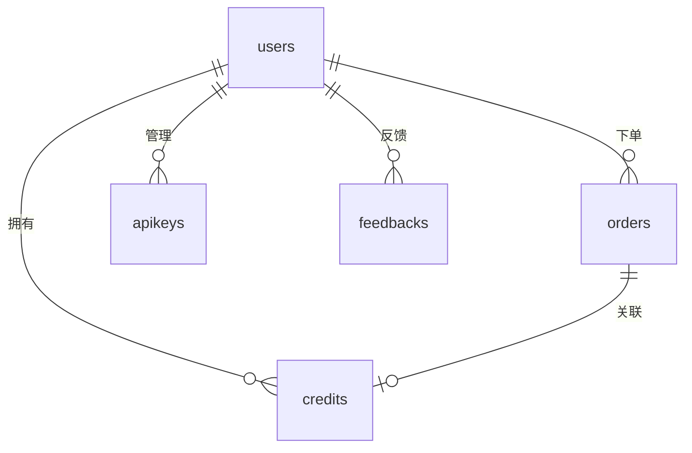

# 数据库设计 (Data Design)

本文档详细描述了项目的数据库结构，使用 Postgres + Drizzle ORM。

## 数据模型概览

项目采用逻辑关联，未强制物理外键约束，以提高灵活性。

### 1. 用户表 (users)
存储用户核心信息。

| 字段 | 类型 | 说明 |
| :--- | :--- | :--- |
| id | SERIAL | 自增主键 |
| uuid | VARCHAR(255) | 业务唯一标识 |
| email | VARCHAR(255) | 用户邮箱 |
| nickname | VARCHAR(255) | 昵称 |
| avatar_url | VARCHAR(255) | 头像 |
| locale | VARCHAR(50) | 偏好语言 |
| signin_type | VARCHAR(50) | 登录类型 |
| signin_provider | VARCHAR(50) | OAuth 提供商 |
| created_at | timestamptz | 创建时间 |
| updated_at | timestamptz | 更新时间 |

### 2. 订单表 (orders)
记录支付交易。

| 字段 | 类型 | 说明 |
| :--- | :--- | :--- |
| id | SERIAL | 自增主键 |
| order_no | VARCHAR(255) | 订单号 (UNIQUE) |
| user_uuid | VARCHAR(255) | 用户标识 |
| amount | INT | 金额 (分) |
| currency | VARCHAR(50) | 货币 (usd/cny) |
| status | VARCHAR(50) | 状态 (created/paid/deleted) |
| credits | INT | 包含积分数 |
| provider_code | VARCHAR(50) | 结算商 (stripe, etc.) |
| provider_session_id | VARCHAR(255) | 结算商会话 ID |
| paid_at | timestamptz | 支付时间 |
| paid_email | VARCHAR(255) | 支付邮箱 |
| paid_detail | TEXT | 支付详情 JSON |

### 3. 积分流转表 (credits)
记录积分的增加与消耗。

| 字段 | 类型 | 说明 |
| :--- | :--- | :--- |
| id | SERIAL | 自增主键 |
| trans_no | VARCHAR(255) | 流水号 (UNIQUE) |
| user_uuid | VARCHAR(255) | 用户标识 |
| trans_type | VARCHAR(50) | 类型 (new_user, order_pay, etc.) |
| credits | INT | 变动值 |
| order_no | VARCHAR(255) | 关联订单号 |
| expired_at | timestamptz | 过期时间 |

### 4. API 密钥表 (apikeys)
用户生成的 API 访问凭证。

| 字段 | 类型 | 说明 |
| :--- | :--- | :--- |
| id | SERIAL | 自增主键 |
| api_key | VARCHAR(255) | 密钥明文/哈希 |
| user_uuid | VARCHAR(255) | 用户标识 |
| status | VARCHAR(50) | 状态 |

### 5. 内容文章表 (posts)
博客及 CMS 内容。

| 字段 | 类型 | 说明 |
| :--- | :--- | :--- |
| id | SERIAL | 自增主键 |
| uuid | VARCHAR(255) | 唯一标识 |
| slug | VARCHAR(255) | URL 别名 |
| title | VARCHAR(255) | 标题 |
| content | TEXT | 正文内容 |
| status | VARCHAR(50) | 状态 (online, offline) |
| locale | VARCHAR(50) | 语言 |

### 6. 反馈表 (feedbacks)
用户提交的反馈。

| 字段 | 类型 | 说明 |
| :--- | :--- | :--- |
| id | SERIAL | 自增主键 |
| user_uuid | VARCHAR(255) | 用户标识 |
| content | TEXT | 反馈内容 |
| rating | INT | 评分 (1-5) |

### 7. 系统设置表 (settings)
存储系统配置、主题 token 等。

| 字段 | 类型 | 说明 |
| :--- | :--- | :--- |
| id | SERIAL | 自增主键 |
| key | VARCHAR(255) | 配置键 (UNIQUE) |
| value | TEXT | 配置值 (JSON) |
| updated_at | timestamptz | 更新时间 |

### 8. 产品定价表 (products)
存储可售卖的套餐及价格。

| 字段 | 类型 | 说明 |
| :--- | :--- | :--- |
| id | SERIAL | 自增主键 |
| product_id | VARCHAR(255) | 商品 ID (UNIQUE) |
| name | VARCHAR(255) | 商品名称 |
| amount | INT | 金额 (分) |
| currency | VARCHAR(50) | 货币 |
| interval | VARCHAR(50) | 周期 (month/year/one-time) |
| credits | INT | 所含积分 |
| status | VARCHAR(50) | 状态 (active/inactive) |

### 9. 审计日志表 (audit_logs)
记录系统关键操作日志。

| 字段 | 类型 | 说明 |
| :--- | :--- | :--- |
| id | SERIAL | 自增主键 |
| user_uuid | VARCHAR(255) | 操作人标识 |
| action | VARCHAR(255) | 动作描述 |
| target_type | VARCHAR(100) | 目标类型 (order, user, setting) |
| target_id | VARCHAR(255) | 目标 ID |
| detail | TEXT | 详情 JSON |
| created_at | timestamptz | 记录时间 |

## 实体关系图 (ER Diagram)

