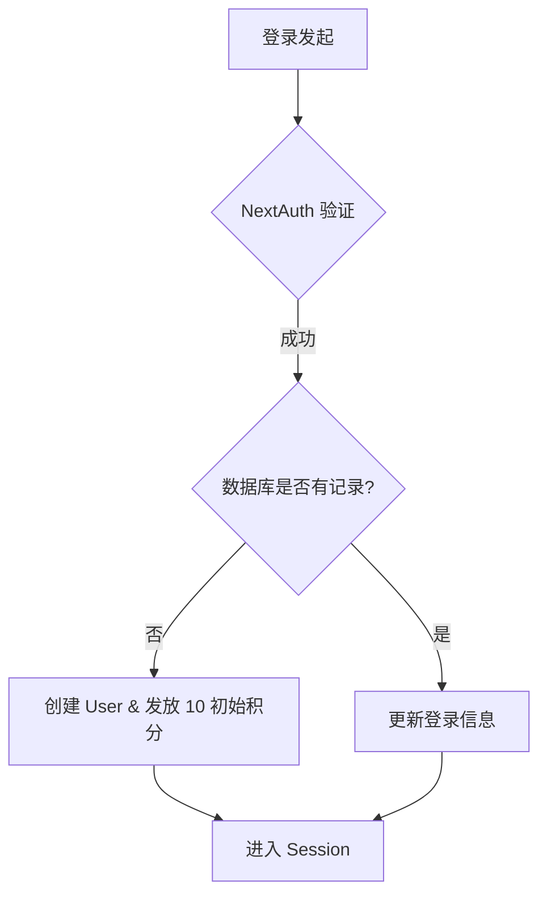
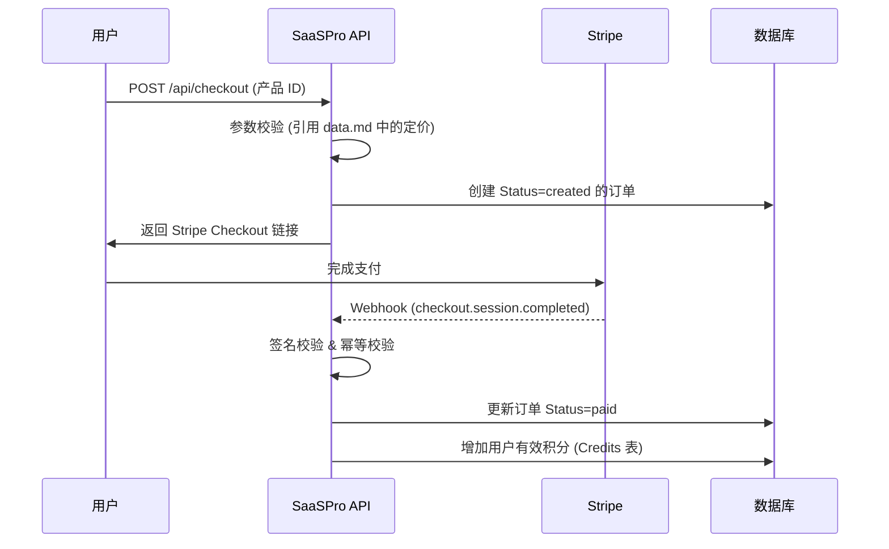

# 技术方案设计 (Technical Design)

本文档描述了 SaaSPro 项目的技术架构方案，旨在为开发提供清晰的指导方针。

## 1. 项目概述与目标

SaaSPro 是一个通用的 SaaS 基础框架，支持多语言、内支出、积分体系以及完善的后台管理系统。
核心目标：
- **高效开发**: 建立可复用的组件与业务逻辑。
- **业务隔离**: 实现前台（用户）与后台（运营）的物理/逻辑隔离。
- **可扩展性**: 灵活的主题/皮肤系统以及积木式的业务模块。

## 2. 技术栈选型

| 维度 | 技术选型 | 理由 |
| :--- | :--- | :--- |
| **基础语言** | TypeScript | 强类型保证，提升大型项目可维护性。 |
| **框架** | Next.js (App Router) | 全栈能力，支持 SSR/SSG，路由与布局方案成熟。 |
| **数据库** | PostgreSQL | 稳定可靠的关系型数据库。 |
| **ORM** | Drizzle ORM | 轻量、类型安全，SQL-like 体验，性能卓越。 |
| **国际化** | next-intl | 完善的 Next.js 多语言集成方案。 |
| **UI 组件库** | Shadcn UI (Radix UI + Tailwind) | 高度可定制且支持辅助功能。 |
| **认证** | Next-Auth (Auth.js) | 成熟的 Social Login 与 Session 管理方案。 |
| **通知系统** | Sonner | 轻量、美观的 Toast 通知。 |

## 3. 架构设计

### 3.1 目录结构

```text
/
├── app/                  # Next.js App Router 核心目录
│   └── [locale]/         # 国际化路由
│       ├── (default)/    # 前台业务分组
│       └── (admin)/      # 后台业务分组 (Admin Dashboard)
├── components/           # 共享 UI 组件
├── lib/                  # 公用工具函数
├── models/               # 数据模型定义与 Drizzle Schema
├── services/             # 业务逻辑服务层 (db 操作汇聚)
├── docs/                 # 项目文档
│   └── spec/             # 设计与规范文档
│       ├── design.md     # 本文档
│       ├── data.md       # 数据库详情
│       └── api.md        # API 详情
├── public/               # 静态资源
└── drizzle.config.ts     # Drizzle 迁移配置
```

### 3.2 路由与布局隔离

- **前台**: 位于 `app/[locale]/(default)/`。使用 `DefaultLayout`。
- **后台**: 位于 `app/[locale]/(admin)/`。使用 `DashboardLayout`，包含侧边栏导航。任何 `/admin/*` 路由均需经过 Admin 邮箱白名单鉴权。

### 3.3 业务逻辑流 (Mermaid)

#### 认证与用户生命周期



#### 支付与权益发放 (Stripe)



## 4. 数据库设计

详细表结构见 [data.md](file:///e:/NextCloud/coding/github/saaspro/docs/spec/data.md)。
- **核心表**: `users`, `orders`, `credits`, `apikeys`, `posts`, `feedbacks`, `settings`, `products`, `audit_logs`。
- **ORM 管理**: 使用 Drizzle Kit 进行迁移生成与推送。
- **删除策略**: 统一定义 `status=deleted` 作为全系统通用的**软删除**标准。

## 5. 接口设计

详细 API 规范见 [api.md](file:///e:/NextCloud/coding/github/saaspro/docs/spec/api.md)。
- **统一入口**: 支付回调统一入口为 `/api/settlement-notify`。
- **RESTful**: 优先使用标准的 HTTP 方法。
- **响应格式**: `{ "success": boolean, "data": any, "error": string }`。

## 6. 安全性设计

- **环境变量**: 严禁在代码中硬编码秘钥，统一通过 `.env.local` 管理。
- **API Key 安全**: `apikeys` 表中的 `api_key` 字段必须以**单向哈希 (如 SHA-256/bcrypt)** 形式存储，绝不能明文存储。
- **行级安全 (RLS)**: 在 DB 层面（或 Service 层硬约束）确保用户只能访问自己的数据。
- **频率限制 (Rate Limiting)**: 后端 API 使用 Upstash Redis 或内存策略限制请求频率。
- **输入校验**: 使用 `zod` 验证所有 API 请求的输入参数。

## 7. 测试策略

- **单元测试 (Unit)**: 使用 `vitest` 对 `lib/` 和 `services/` 中的核心逻辑进行测试。
- **集成测试 (Integration)**: 测试 API 路由与数据库的交互。
- **E2E 测试 (End-to-End)**: 使用 `Playwright` 覆盖关键路径（登录 -> 下单 -> 支付成功 -> 查看积分）。

## 8. 工程化与 CI/CD

- **Git Hooks**: 使用 Husky 和 lint-staged。在 `pre-commit` 阶段强制运行 `eslint` 和 `tsc` 检查，确保提交的代码符合规范。
- **CI/CD 工作流**: 
    - 使用 GitHub Actions 实现自动化流程。
    - **代码审计**: 每次推送或 PR 时运行 lint 和类型检查。
    - **安全扫描**: 集成安全扫描工具（如 Semgrep、Gitleaks）对源代码和秘钥等敏感信息进行扫描。
    - **自动化测试**: CI 流程中自动执行单元测试与集成测试。

## 9. 主题与皮肤系统 (Theme System)

- **逻辑分离**: 业务逻辑不依赖具体 CSS 变量。
- **配置驱动**: 通过后台设置主色调、圆角、Logo。前端通过 Tailwind 动态类名或 CSS Variables 消费这些设置。
| 角色 | 权限范围 |
| :--- | :--- |
| **访客** | 浏览首页、定价、博客。 |
| **用户** | 登录、购买套餐、使用积分、提交反馈。 |
| **管理员** | 后格全权限（由 ADMIN_EMAILS 配置）。 |
